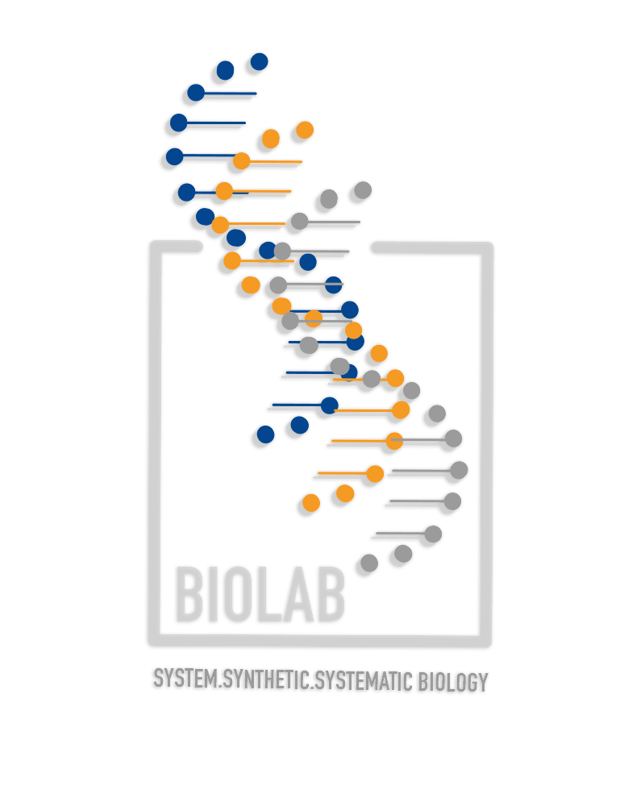

# Welcome {.unnumbered}

Welcome to the **Systems.Synthetic.Systematic Biology (S3Bio)** lab! We are thrilled to have you join our team.

This orientation book is designed to help you navigate your first few weeks in the lab.

::: {.callout-note}
## First Steps
- Complete your safety training.
- Set up your lab accounts.
- Schedule a meeting with your mentor.
:::

{fig-align="center" width="300"}
